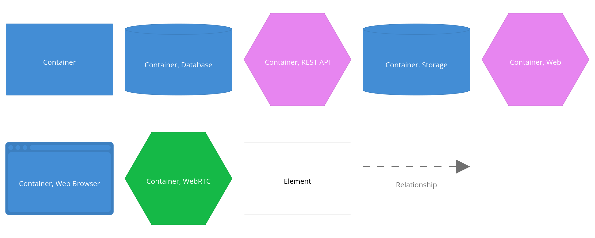

# Developer Mode (devcontainers)

This mode is intended for experienced software engineers with basic DevOps skills. Backend of `yag.im` is written in 
Python, except of a few components. In this mode, all service instances run on the local host within Docker containers 
(as devcontainers in the IDE (VS Code is recommended)).
Basically the deployment diagram will look as below:

## Prerequisite

### System requirements

**Operating System**: any OS that supports Docker containers should work. Note that `yag.im` has been primarily tested 
on Linux OS (Debian).

**Memory**: the more, the better. However, a minimum of 8GB should suffice.

**CPU**: amd64-architecture based CPU with 8 cores should meet the minimum requirement.

**GPU**: the presence of a GPU is highly recommended for video encoding offloading. Thorough testing has shown that 
Intel HD and Nvidia GPUs perform well in this role. CPU video encoding is also supported, but it may impact performance.

**Storage**: a dedicated external SSD drive (250GB+) is recommended for storing game source images and installed games 
bundles. At a minimum, a local folder should be sufficient.

### Software dependencies

#### Docker

#### IDE

IDE supporting devcontainers (VS Code is recommended as it was thoroughly tested).

#### Browser

Chrome is recommended and tested more than other browsers.

## Setup

It's important to follow all steps below in a given order.

### Storage

Storage is a crucial part of the cloud gaming infrastructure. In developer mode, persistent storage structure must look
as below:

    ~/yag/data/
               ports/
               scrapers/
               sqldb/

It's recommended to use a dedicated SSD drive, e.g.:

    sudo mount -t ntfs-3g -o rw,user,exec,uid=1000,gid=1000,dmask=0007,fmask=0007 /dev/sda1 /mnt/yag_data_drive &

with symlinks:

    ln -s /mnt/yag_data_drive/ports ~/yag/data/ports
    ln -s /mnt/yag_data_drive/scrapers ~/yag/data/scrapers
    ln -s /mnt/yag_data_drive/sqldb ~/yag/data/sqldb

If you don't own an extra SSD drive, local folders should also work:

    mkdir -p ~/yag/data/ports
    mkdir -p ~/yag/data/scrapers
    mkdir -p ~/yag/data/sqldb

#### Init storage data

Now we need to init local storage with some data. At least scrapers data folder should be initialized in order to 
start the local SQL DB instance (next step). For this, clone [scrapers](https://github.com/yag-im/scrapers) project and 
follow instructions from the `development` section of the 
[README](https://github.com/yag-im/scrapers?tab=readme-ov-file#development) document.

### SQL DB

After [SQL DB](https://github.com/yag-im/sqldb) repo is cloned, SQL DB docker container should be built and started 
manually. Follow instructions from the `development` section of the 
[README](https://github.com/yag-im/sqldb?tab=readme-ov-file#development) document.
This step will also require [ports](https://github.com/yag-im/ports) repo to be cloned to init `games.releases` table.

### Web Proxy

In order to route queries from application running in a web browser to respective endpoints, an instance of web proxy
is required. The main purpose of this instance is routing following types of queries:

    /api - webapi (API gateway)
    /auth - authentication service
    /webrtc - sigsvc (WebRTC Signaling Service)
    / - webapp (NextJS server-side functionality)

### Devconatiners
