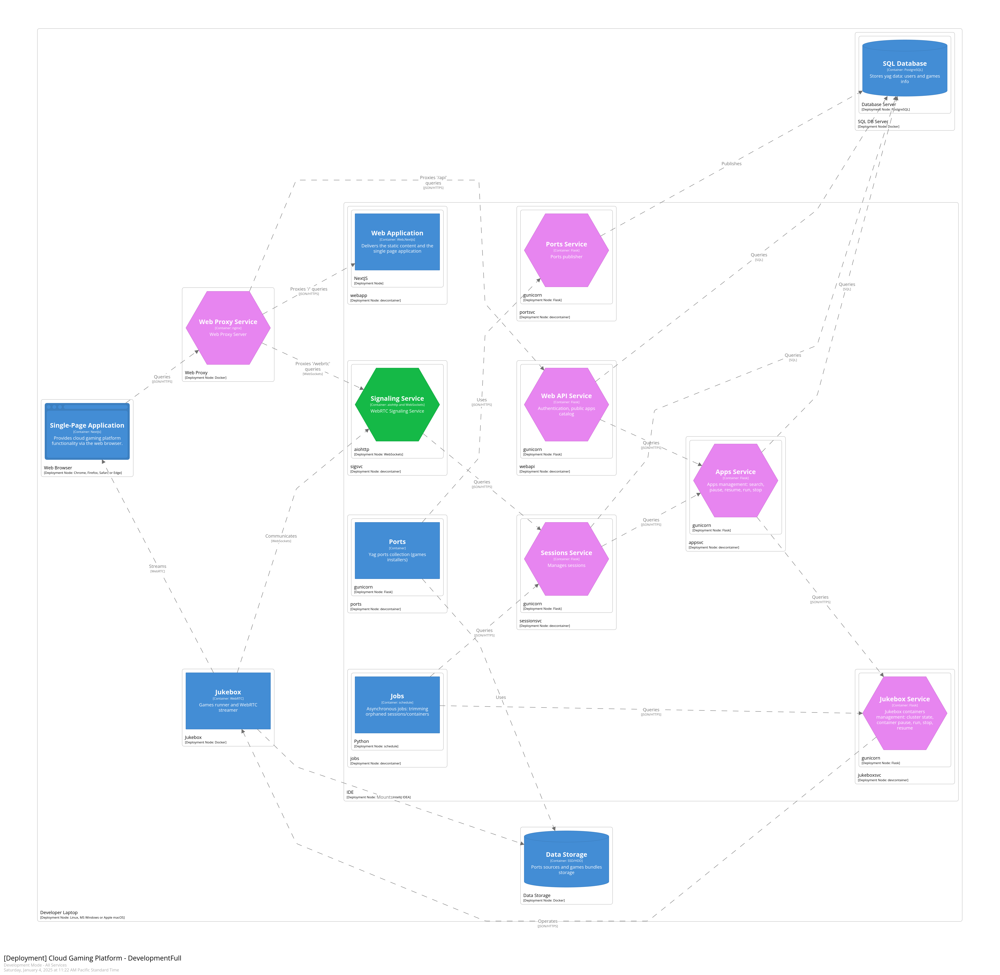

# Developer Mode (devcontainers)

This mode is intended for experienced software engineers with basic devops skills. Backend of `yag.im` is written in 
Python, except of a few components. In this mode, all service instances run on the local host within Docker containers: 
as devcontainers in the IDE (VSCode is recommended).
Basically the deployment diagram will look as below:

## Prerequisite

### System requirements

**Operating System**: any OS that supports Docker containers should work. Note that `yag.im` has been primarily tested 
on Linux OS (Debian).

**Memory**: the more, the better. However, a minimum of 8GB should suffice.

**CPU**: amd64-architecture based CPU with 8 cores should meet the minimum requirement.

**GPU**: the presence of a GPU is highly recommended for video encoding offloading. Thorough testing has shown that 
Intel HD and Nvidia GPUs perform well in this role. CPU video encoding is also supported, but it may impact gameplay
experience significantly.

**Storage**: a dedicated external SSD drive (250GB+) is recommended for storing game source images and installed games 
bundles. At a minimum, a local folder should be sufficient.

### Software dependencies

#### Docker

#### IDE

IDE supporting devcontainers (VSCode is recommended as it was thoroughly tested).

#### Browser

Chrome is the preferred and most thoroughly tested browser.

## Setup

It's important to follow all steps below in a given order.

### Storage

Storage is a crucial part of the cloud gaming infrastructure. In developer mode, persistent storage structure must look
as below:

    ~/yag/data/
               ports/
               scrapers/
               sqldb/

It's recommended to use a dedicated SSD drive, e.g.:

    sudo mount -t ntfs-3g -o rw,user,exec,uid=1000,gid=1000,dmask=0007,fmask=0007 /dev/sda1 /mnt/yag_data_drive &

with symlinks:

    ln -s /mnt/yag_data_drive/ports ~/yag/data/ports
    ln -s /mnt/yag_data_drive/scrapers ~/yag/data/scrapers
    ln -s /mnt/yag_data_drive/sqldb ~/yag/data/sqldb

If you don't own an extra SSD drive, local folders should also work:

    mkdir -p ~/yag/data/ports
    mkdir -p ~/yag/data/scrapers
    mkdir -p ~/yag/data/sqldb

#### Init storage data

Now we need to init local storage with some data. At least scrapers data folder should be initialized in order to 
start the local SQL DB instance (next step). For this, clone [scrapers](https://github.com/yag-im/scrapers) project and 
follow instructions from the `development` section of the 
[README](https://github.com/yag-im/scrapers?tab=readme-ov-file#development) document.

> [!IMPORTANT]  
> Checkpoint:
>
> ls ~/yag/data/scrapers/igdb
>
> genres.csv platforms.csv companies.csv games.csv

### SQL DB

After [SQL DB](https://github.com/yag-im/sqldb) repo is cloned, SQL DB docker container should be built and started 
manually. Follow instructions from the `development` section of the 
[README](https://github.com/yag-im/sqldb?tab=readme-ov-file#development) document.
This step will also require [ports](https://github.com/yag-im/ports) and 
[portsvc](https://github.com/yag-im/portsvc) 
repositories to be cloned to init `games.releases` table from `ports` project:

    cd scripts
    python post_all_releases.py

> [!IMPORTANT]  
> Checkpoint:
>
> games.releases SQL table contains records.

### Web Proxy

In order to route queries from application running in a web browser to respective endpoints, an instance of web proxy
is required. The main purpose of this instance is proxying following types of queries:

    /api    - webapi (API gateway)
    /auth   - authentication service (currently same as webapi)
    /webrtc - sigsvc (WebRTC Signaling Service)
    /       - webapp (NextJS server-side functionality)

Clone [webproxy](https://github.com/yag-im/webproxy) project

### Jukebox

Jukebox (game runners) docker images can be either be all built locally by cloning
[jukebox](https://github.com/yag-im/jukebox) repository and running:

    make build-all

or by pulling them from `ghcr.io` repository:

    cd scripts
    pull_images.sh local_all

#### Docker API

In order to control `jukebox` containers locally from [jukeboxsvc](https://github.com/yag-im/jukeboxsvc), docker daemon
access should be exposed as below:

    # /etc/systemd/system/docker.service.d/override.conf

    [Service]
    ExecStart=
    ExecStart=/usr/bin/dockerd -H fd:// -H tcp://0.0.0.0:2375 --containerd=/run/containerd/containerd.sock

For Mac users, `socat` hack might be required instead:

    socat -d TCP-LISTEN:2375,reuseaddr,fork UNIX:/var/run/docker.sock

#### Docker volume

### The rest of microservices

You'll also need to run other services following README instructions from appropriate repositories:

[appsvc](https://github.com/yag-im/appsvc)

[jobs](https://github.com/yag-im/jobs)

[jukeboxsvc](https://github.com/yag-im/jukeboxsvc)

[sessionsvc](https://github.com/yag-im/sessionsvc)

[sigsvc](https://github.com/yag-im/sigsvc)

[webapi](https://github.com/yag-im/webapi)

### /etc/hosts modifications

You'll also need to update `/etc/hosts` with a following entries:

    127.0.0.1 appsvc.yag.dc jukeboxsvc.yag.dc sessionsvc.yag.dc sigsvc.yag.dc sqldb.yag.dc webapi.yag.dc yag.dc
